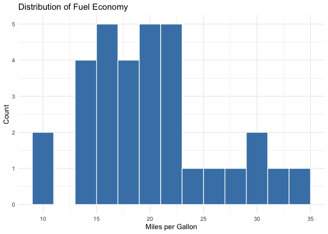
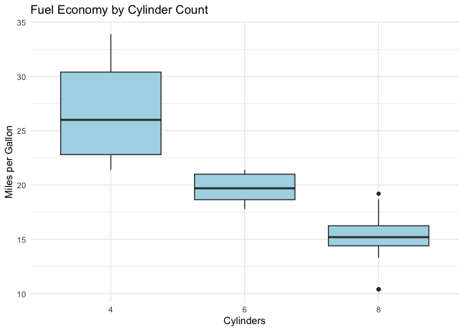
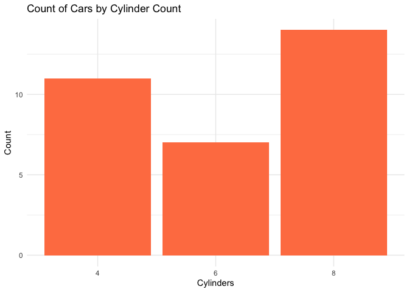
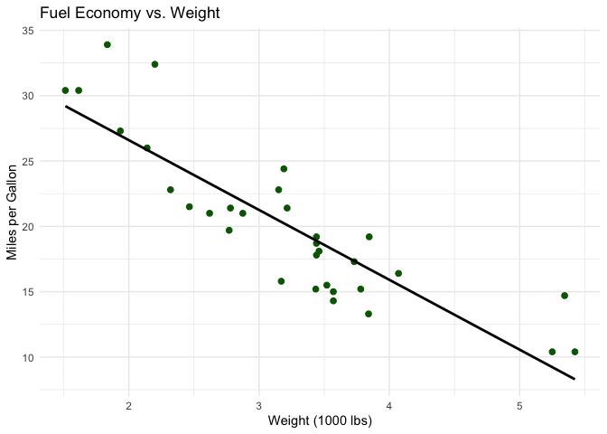
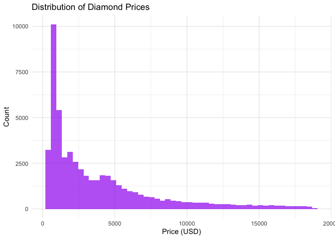
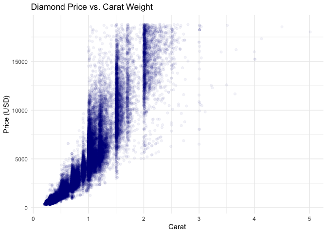

# A Practical Guide to Descriptive Analysis in R
Your Name
2026-07-11

## Introduction

Every good data analysis begins in the same place: not with a machine
learning model, not with a p-value, and not with a fancy visualization,
but with a quiet, careful look at the data itself. This process is
called **descriptive analysis** (or descriptive statistics), and it is
one of the most undervalued skills in the analytics toolkit. It’s the
difference between an analyst who understands their data and one who is
simply running code against it.

Descriptive analysis answers a deceptively simple question: *what does
this dataset actually look like?* How many rows and columns does it
have? What are the typical values? How spread out are they? Are there
outliers, missing values, or strange distributions lurking beneath the
surface? Long before you fit a regression, train a classifier, or run a
hypothesis test, you need to answer these questions. Skipping this step
is how analysts end up building models on data riddled with data-entry
errors, skewed distributions, or hidden subgroups that quietly bias
every result downstream.

R is, arguably, the best environment in existence for this kind of work.
It was built by statisticians, for statisticians, and descriptive
analysis is baked into its DNA. A single function call — `summary()` —
will give you more useful information about a dataset than many other
languages will give you in ten lines of code. Layer on packages like
**dplyr**, **skimr**, **psych**, and **ggplot2**, and you have a
complete, expressive toolkit for exploring any dataset that lands on
your desk.

This article walks through descriptive analysis in R from first
principles to more advanced techniques. We’ll cover:

- What descriptive statistics are and why they matter
- Getting to know a dataset’s structure
- Measures of central tendency (mean, median, mode)
- Measures of spread and variability (variance, standard deviation,
  range, IQR)
- Frequency tables and proportions for categorical data
- Using `summary()`, `skimr::skim()`, and `psych::describe()` for fast
  overviews
- Grouped descriptive statistics with `dplyr`
- Correlation between variables
- Visualizing distributions with `ggplot2`
- Handling missing data during descriptive analysis
- Putting it all together in a repeatable workflow

We’ll use two datasets that ship with base R and ggplot2 — `mtcars` and
`diamonds` — so you can follow along without downloading anything. Let’s
get started.

## What Is Descriptive Analysis, Really?

Descriptive analysis is the branch of statistics concerned with
summarizing and organizing data so that it can be understood at a
glance, without drawing conclusions that go beyond the data itself. It
stands in contrast to **inferential statistics**, which uses sample data
to make claims about a broader population — think confidence intervals,
hypothesis tests, and regression coefficients with p-values attached.

Descriptive statistics don’t try to predict anything or generalize to a
population; they simply describe what’s in front of you. If you
calculate the average commute time for 200 survey respondents, that’s
descriptive. If you use that average to estimate the average commute
time for an entire city, and attach a margin of error to it, that’s
inferential.

This distinction matters because descriptive analysis is a prerequisite
for almost everything else you’ll do with data. You cannot sensibly
interpret a regression coefficient if you don’t know the scale, spread,
or distribution of the underlying variable. You cannot spot a data
quality issue if you never look at minimums, maximums, and counts of
missing values. Descriptive analysis is the seatbelt of data science —
unglamorous, but the thing that keeps you from a serious accident.

Broadly, descriptive analysis covers four categories of tools:

1.  **Measures of central tendency** — where is the “middle” of the
    data? (mean, median, mode)
2.  **Measures of dispersion** — how spread out is the data? (range,
    variance, standard deviation, interquartile range)
3.  **Measures of shape** — is the distribution symmetric, skewed,
    peaked, or flat? (skewness, kurtosis)
4.  **Frequency and proportion summaries** — for categorical variables,
    how often does each category occur?

R gives you fast, idiomatic ways to compute all four categories, and
we’ll go through each one in turn.

## Getting to Know Your Dataset’s Structure

Before computing a single statistic, you need to understand the shape
and structure of your dataset: how many observations, how many
variables, and what type each variable is (numeric, character, factor,
logical, date). R provides several functions for this reconnaissance
step.

``` r
library(dplyr)
library(ggplot2)

data(mtcars)
str(mtcars)
```

    'data.frame':   32 obs. of  11 variables:
     $ mpg : num  21 21 22.8 21.4 18.7 18.1 14.3 24.4 22.8 19.2 ...
     $ cyl : num  6 6 4 6 8 6 8 4 4 6 ...
     $ disp: num  160 160 108 258 360 ...
     $ hp  : num  110 110 93 110 175 105 245 62 95 123 ...
     $ drat: num  3.9 3.9 3.85 3.08 3.15 2.76 3.21 3.69 3.92 3.92 ...
     $ wt  : num  2.62 2.88 2.32 3.21 3.44 ...
     $ qsec: num  16.5 17 18.6 19.4 17 ...
     $ vs  : num  0 0 1 1 0 1 0 1 1 1 ...
     $ am  : num  1 1 1 0 0 0 0 0 0 0 ...
     $ gear: num  4 4 4 3 3 3 3 4 4 4 ...
     $ carb: num  4 4 1 1 2 1 4 2 2 4 ...

The `str()` function is often the very first thing an experienced R user
runs on new data. It reports the number of observations and variables,
and for each column, its data type and a preview of the first few
values. In `mtcars`, every column happens to be numeric, but in most
real-world datasets you’ll see a mix of numeric, character, and factor
columns.

Two close cousins of `str()` are `dim()`, which returns the number of
rows and columns, and `glimpse()` from `dplyr`, which produces a similar
(arguably more readable) summary:

``` r
dim(mtcars)
```

    [1] 32 11

``` r
glimpse(mtcars)
```

    Rows: 32
    Columns: 11
    $ mpg  <dbl> 21.0, 21.0, 22.8, 21.4, 18.7, 18.1, 14.3, 24.4, 22.8, 19.2, 17.8,…
    $ cyl  <dbl> 6, 6, 4, 6, 8, 6, 8, 4, 4, 6, 6, 8, 8, 8, 8, 8, 8, 4, 4, 4, 4, 8,…
    $ disp <dbl> 160.0, 160.0, 108.0, 258.0, 360.0, 225.0, 360.0, 146.7, 140.8, 16…
    $ hp   <dbl> 110, 110, 93, 110, 175, 105, 245, 62, 95, 123, 123, 180, 180, 180…
    $ drat <dbl> 3.90, 3.90, 3.85, 3.08, 3.15, 2.76, 3.21, 3.69, 3.92, 3.92, 3.92,…
    $ wt   <dbl> 2.620, 2.875, 2.320, 3.215, 3.440, 3.460, 3.570, 3.190, 3.150, 3.…
    $ qsec <dbl> 16.46, 17.02, 18.61, 19.44, 17.02, 20.22, 15.84, 20.00, 22.90, 18…
    $ vs   <dbl> 0, 0, 1, 1, 0, 1, 0, 1, 1, 1, 1, 0, 0, 0, 0, 0, 0, 1, 1, 1, 1, 0,…
    $ am   <dbl> 1, 1, 1, 0, 0, 0, 0, 0, 0, 0, 0, 0, 0, 0, 0, 0, 0, 1, 1, 1, 0, 0,…
    $ gear <dbl> 4, 4, 4, 3, 3, 3, 3, 4, 4, 4, 4, 3, 3, 3, 3, 3, 3, 4, 4, 4, 3, 3,…
    $ carb <dbl> 4, 4, 1, 1, 2, 1, 4, 2, 2, 4, 4, 3, 3, 3, 4, 4, 4, 1, 2, 1, 1, 2,…

It’s also worth checking column names and the first and last few rows of
the data, using `names()`, `head()`, and `tail()`:

``` r
names(mtcars)
```

     [1] "mpg"  "cyl"  "disp" "hp"   "drat" "wt"   "qsec" "vs"   "am"   "gear"
    [11] "carb"

``` r
head(mtcars, 3)
```

                   mpg cyl disp  hp drat    wt  qsec vs am gear carb
    Mazda RX4     21.0   6  160 110 3.90 2.620 16.46  0  1    4    4
    Mazda RX4 Wag 21.0   6  160 110 3.90 2.875 17.02  0  1    4    4
    Datsun 710    22.8   4  108  93 3.85 2.320 18.61  1  1    4    1

``` r
tail(mtcars, 3)
```

                   mpg cyl disp  hp drat   wt qsec vs am gear carb
    Ferrari Dino  19.7   6  145 175 3.62 2.77 15.5  0  1    5    6
    Maserati Bora 15.0   8  301 335 3.54 3.57 14.6  0  1    5    8
    Volvo 142E    21.4   4  121 109 4.11 2.78 18.6  1  1    4    2

This might feel like a trivial step, but it catches an enormous number
of problems early: columns that were imported as text instead of
numbers, unexpected extra columns from a bad CSV parse, or a dataset
that’s smaller than you expected because a join dropped rows silently.
Get in the habit of running `str()` or `glimpse()` immediately after
loading any dataset, before you do anything else.

## Measures of Central Tendency

Central tendency statistics summarize where the “center” of a
distribution sits. The three classic measures are the mean, median, and
mode, and each tells you something slightly different.

### The Mean

The arithmetic mean is the sum of all values divided by the number of
values. In R, it’s computed with `mean()`:

``` r
mean(mtcars$mpg)
```

    [1] 20.09062

The average fuel economy across the 32 cars in `mtcars` is about 20
miles per gallon. The mean is sensitive to every single value in the
dataset, including outliers — a single car with extraordinarily high or
low mpg will pull the mean in its direction. This sensitivity is both
the mean’s strength (it uses all available information) and its weakness
(it can be misleading in skewed distributions).

### The Median

The median is the middle value when data is sorted — the point at which
half the observations fall below and half fall above. Unlike the mean,
the median is robust to outliers, which is why it’s often preferred for
skewed data like income or house prices.

``` r
median(mtcars$mpg)
```

    [1] 19.2

When the mean and median diverge noticeably, that’s a signal the
distribution is skewed. If the mean is higher than the median, the data
has a long right tail (a few very large values are pulling the average
up); if the mean is lower than the median, the tail is on the left.

### The Mode

Oddly, base R has no built-in `mode()` function for statistical mode
(the `mode()` function in R actually refers to the storage mode of an
object, a completely different concept). To find the most frequently
occurring value, you typically write a small helper function or use a
table:

``` r
get_mode <- function(x) {
  freq_table <- table(x)
  names(freq_table)[which.max(freq_table)]
}

get_mode(mtcars$cyl)
```

    [1] "8"

The mode is most useful for categorical or discrete variables. In
`mtcars`, the number of cylinders is a discrete variable, and the mode
tells us the most common engine configuration among these cars. For
continuous variables like mpg, the mode is less meaningful unless you’re
describing a specific peak in the distribution (in which case a density
plot is usually more informative than a single mode value).

### Trimmed Means and Robust Alternatives

When your data contains outliers but you still want something mean-like,
a **trimmed mean** — which discards a fixed percentage of the most
extreme values before averaging — is a useful middle ground between the
mean and median:

``` r
mean(mtcars$mpg, trim = 0.1)
```

    [1] 19.69615

This computes the mean after removing the top and bottom 10% of values,
reducing the influence of extreme observations while still using more of
the distribution’s information than the median alone.

## Measures of Dispersion

Central tendency tells you where the data sits, but it says nothing
about how spread out the values are. Two datasets can have identical
means and completely different variability — one tightly clustered, one
wildly dispersed. Measures of dispersion capture this.

### Range

The range is simply the difference between the maximum and minimum
values:

``` r
range(mtcars$mpg)
```

    [1] 10.4 33.9

``` r
diff(range(mtcars$mpg))
```

    [1] 23.5

The `range()` function returns both the minimum and maximum; wrapping it
in `diff()` gives you the single numeric range. The range is intuitive
but fragile — it depends entirely on the two most extreme observations,
which makes it very sensitive to outliers.

### Variance and Standard Deviation

Variance measures the average squared deviation from the mean, and
standard deviation is simply the square root of variance, which brings
the units back to the original scale of the data (making it much easier
to interpret).

``` r
var(mtcars$mpg)
```

    [1] 36.3241

``` r
sd(mtcars$mpg)
```

    [1] 6.026948

A standard deviation of roughly 6 mpg tells us that fuel economy values
typically deviate from the mean of about 20 mpg by around 6 mpg in
either direction. Standard deviation is one of the most widely used
dispersion statistics because it plays nicely with the normal
distribution and countless downstream techniques (z-scores, confidence
intervals, control charts, and so on).

One subtlety worth knowing: R’s `var()` and `sd()` compute the
**sample** variance and standard deviation by default, dividing by
`n - 1` rather than `n`. This is Bessel’s correction, which produces an
unbiased estimator of the population variance when working with a
sample. It’s the standard behavior for most statistical software, but
worth remembering if you’re comparing results against manual
calculations.

### Interquartile Range (IQR)

The interquartile range measures the spread of the middle 50% of the
data — the distance between the 75th percentile (Q3) and the 25th
percentile (Q1). It’s a robust measure of spread, largely unaffected by
outliers.

``` r
IQR(mtcars$mpg)
```

    [1] 7.375

``` r
quantile(mtcars$mpg)
```

        0%    25%    50%    75%   100% 
    10.400 15.425 19.200 22.800 33.900 

The `quantile()` function by default returns the minimum, Q1, median,
Q3, and maximum — the five-number summary that underlies every boxplot
you’ve ever seen. You can request arbitrary percentiles too:

``` r
quantile(mtcars$mpg, probs = c(0.1, 0.9))
```

      10%   90% 
    14.34 30.09 

This tells you the 10th and 90th percentile values, useful when you want
to describe the “typical range” of a variable while excluding the most
extreme 10% on each end.

### Coefficient of Variation

When you want to compare the relative variability of two variables
measured on different scales, the standard deviation alone isn’t a fair
comparison. The **coefficient of variation** (CV) — standard deviation
divided by the mean, often expressed as a percentage — normalizes for
scale:

``` r
cv <- function(x) sd(x, na.rm = TRUE) / mean(x, na.rm = TRUE) * 100
cv(mtcars$mpg)
```

    [1] 29.99881

``` r
cv(mtcars$hp)
```

    [1] 46.74077

This tells you that horsepower varies more, relative to its own average,
than mpg does — a comparison that raw standard deviations alone couldn’t
make fairly, since horsepower and mpg live on very different numeric
scales.

## Skewness and Kurtosis

Beyond center and spread, it’s often useful to describe the **shape** of
a distribution. Two statistics capture this: skewness and kurtosis.

**Skewness** measures asymmetry. A skewness of zero indicates a
symmetric distribution; positive skewness indicates a long right tail
(common in income data, for example); negative skewness indicates a long
left tail.

**Kurtosis** measures “tailedness” — how much of the distribution’s
variance comes from extreme, rare values versus frequent, moderate
deviations. A normal distribution has a kurtosis of 3 (or 0 if using
“excess kurtosis,” which subtracts 3 as a baseline).

Base R doesn’t include skewness or kurtosis functions, but the `moments`
and `psych` packages do:

``` r
library(psych)
skew(mtcars$mpg)
```

    [1] 0.610655

``` r
kurtosi(mtcars$mpg)
```

    [1] -0.372766

A positive skewness value here confirms that the mpg distribution has a
longer tail toward higher values — consistent with a handful of very
fuel-efficient cars pulling the mean upward relative to the median.

## Fast, Comprehensive Overviews

Computing each statistic one at a time is instructive when you’re
learning, but in practice you’ll usually want a fast, comprehensive
overview of an entire dataset. R offers several options, each with a
different flavor.

### `summary()`

The base R workhorse. Calling `summary()` on a data frame produces the
five-number summary (plus the mean) for every numeric column, and
frequency counts for factors:

``` r
summary(mtcars)
```

          mpg             cyl             disp             hp       
     Min.   :10.40   Min.   :4.000   Min.   : 71.1   Min.   : 52.0  
     1st Qu.:15.43   1st Qu.:4.000   1st Qu.:120.8   1st Qu.: 96.5  
     Median :19.20   Median :6.000   Median :196.3   Median :123.0  
     Mean   :20.09   Mean   :6.188   Mean   :230.7   Mean   :146.7  
     3rd Qu.:22.80   3rd Qu.:8.000   3rd Qu.:326.0   3rd Qu.:180.0  
     Max.   :33.90   Max.   :8.000   Max.   :472.0   Max.   :335.0  
          drat             wt             qsec             vs        
     Min.   :2.760   Min.   :1.513   Min.   :14.50   Min.   :0.0000  
     1st Qu.:3.080   1st Qu.:2.581   1st Qu.:16.89   1st Qu.:0.0000  
     Median :3.695   Median :3.325   Median :17.71   Median :0.0000  
     Mean   :3.597   Mean   :3.217   Mean   :17.85   Mean   :0.4375  
     3rd Qu.:3.920   3rd Qu.:3.610   3rd Qu.:18.90   3rd Qu.:1.0000  
     Max.   :4.930   Max.   :5.424   Max.   :22.90   Max.   :1.0000  
           am              gear            carb      
     Min.   :0.0000   Min.   :3.000   Min.   :1.000  
     1st Qu.:0.0000   1st Qu.:3.000   1st Qu.:2.000  
     Median :0.0000   Median :4.000   Median :2.000  
     Mean   :0.4062   Mean   :3.688   Mean   :2.812  
     3rd Qu.:1.0000   3rd Qu.:4.000   3rd Qu.:4.000  
     Max.   :1.0000   Max.   :5.000   Max.   :8.000  

In a handful of lines, you get the minimum, first quartile, median,
mean, third quartile, and maximum for every single numeric variable in
the dataset. This is usually the very first command I run on any new
dataset after `str()`.

### `psych::describe()`

The `psych` package’s `describe()` function goes further, adding
standard deviation, skewness, kurtosis, and standard error to the mix,
and organizing everything into a tidy, easy-to-read table:

``` r
describe(mtcars)
```

         vars  n   mean     sd median trimmed    mad   min    max  range  skew
    mpg     1 32  20.09   6.03  19.20   19.70   5.41 10.40  33.90  23.50  0.61
    cyl     2 32   6.19   1.79   6.00    6.23   2.97  4.00   8.00   4.00 -0.17
    disp    3 32 230.72 123.94 196.30  222.52 140.48 71.10 472.00 400.90  0.38
    hp      4 32 146.69  68.56 123.00  141.19  77.10 52.00 335.00 283.00  0.73
    drat    5 32   3.60   0.53   3.70    3.58   0.70  2.76   4.93   2.17  0.27
    wt      6 32   3.22   0.98   3.33    3.15   0.77  1.51   5.42   3.91  0.42
    qsec    7 32  17.85   1.79  17.71   17.83   1.42 14.50  22.90   8.40  0.37
    vs      8 32   0.44   0.50   0.00    0.42   0.00  0.00   1.00   1.00  0.24
    am      9 32   0.41   0.50   0.00    0.38   0.00  0.00   1.00   1.00  0.36
    gear   10 32   3.69   0.74   4.00    3.62   1.48  3.00   5.00   2.00  0.53
    carb   11 32   2.81   1.62   2.00    2.65   1.48  1.00   8.00   7.00  1.05
         kurtosis    se
    mpg     -0.37  1.07
    cyl     -1.76  0.32
    disp    -1.21 21.91
    hp      -0.14 12.12
    drat    -0.71  0.09
    wt      -0.02  0.17
    qsec     0.34  0.32
    vs      -2.00  0.09
    am      -1.92  0.09
    gear    -1.07  0.13
    carb     1.26  0.29

This single call replaces dozens of individual function calls and is
often my preferred starting point when I want a genuinely thorough first
look at a numeric dataset.

### `skimr::skim()`

The `skimr` package takes a more modern, visually enhanced approach. It
works across mixed data types (numeric, character, factor, date) and
even includes a miniature inline histogram for each numeric variable,
letting you spot skew or bimodality without plotting a single chart:

``` r
library(skimr)
skim(mtcars)
```

|                                                  |        |
|:-------------------------------------------------|:-------|
| Name                                             | mtcars |
| Number of rows                                   | 32     |
| Number of columns                                | 11     |
| \_\_\_\_\_\_\_\_\_\_\_\_\_\_\_\_\_\_\_\_\_\_\_   |        |
| Column type frequency:                           |        |
| numeric                                          | 11     |
| \_\_\_\_\_\_\_\_\_\_\_\_\_\_\_\_\_\_\_\_\_\_\_\_ |        |
| Group variables                                  | None   |

Data summary

**Variable type: numeric**

| skim_variable | n_missing | complete_rate | mean | sd | p0 | p25 | p50 | p75 | p100 | hist |
|:---|---:|---:|---:|---:|---:|---:|---:|---:|---:|:---|
| mpg | 0 | 1 | 20.09 | 6.03 | 10.40 | 15.43 | 19.20 | 22.80 | 33.90 | ▃▇▅▁▂ |
| cyl | 0 | 1 | 6.19 | 1.79 | 4.00 | 4.00 | 6.00 | 8.00 | 8.00 | ▆▁▃▁▇ |
| disp | 0 | 1 | 230.72 | 123.94 | 71.10 | 120.83 | 196.30 | 326.00 | 472.00 | ▇▃▃▃▂ |
| hp | 0 | 1 | 146.69 | 68.56 | 52.00 | 96.50 | 123.00 | 180.00 | 335.00 | ▇▇▆▃▁ |
| drat | 0 | 1 | 3.60 | 0.53 | 2.76 | 3.08 | 3.70 | 3.92 | 4.93 | ▇▃▇▅▁ |
| wt | 0 | 1 | 3.22 | 0.98 | 1.51 | 2.58 | 3.33 | 3.61 | 5.42 | ▃▃▇▁▂ |
| qsec | 0 | 1 | 17.85 | 1.79 | 14.50 | 16.89 | 17.71 | 18.90 | 22.90 | ▃▇▇▂▁ |
| vs | 0 | 1 | 0.44 | 0.50 | 0.00 | 0.00 | 0.00 | 1.00 | 1.00 | ▇▁▁▁▆ |
| am | 0 | 1 | 0.41 | 0.50 | 0.00 | 0.00 | 0.00 | 1.00 | 1.00 | ▇▁▁▁▆ |
| gear | 0 | 1 | 3.69 | 0.74 | 3.00 | 3.00 | 4.00 | 4.00 | 5.00 | ▇▁▆▁▂ |
| carb | 0 | 1 | 2.81 | 1.62 | 1.00 | 2.00 | 2.00 | 4.00 | 8.00 | ▇▂▅▁▁ |

`skimr` is especially handy in exploratory workflows and R
Markdown/Quarto reports because its output is designed to render
cleanly, and it automatically groups summary statistics by variable type
— a huge convenience once your dataset contains a mix of numeric,
categorical, and logical columns.

## Descriptive Statistics for Categorical Data

Everything so far has focused on numeric variables, but categorical
variables need their own toolkit: frequency tables, proportions, and
cross-tabulations rather than means and standard deviations.

### Frequency Tables

The base `table()` function counts occurrences of each category:

``` r
table(mtcars$cyl)
```


     4  6  8 
    11  7 14 

This tells you at a glance how many cars in the dataset have 4, 6, or 8
cylinders. To express these counts as proportions rather than raw
counts, wrap the table in `prop.table()`:

``` r
prop.table(table(mtcars$cyl))
```


          4       6       8 
    0.34375 0.21875 0.43750 

Multiplying by 100 turns these into readable percentages:

``` r
round(prop.table(table(mtcars$cyl)) * 100, 1)
```


       4    6    8 
    34.4 21.9 43.8 

### Cross-Tabulations

When you want to understand the relationship between two categorical
variables, a two-way frequency table (cross-tabulation) is the natural
tool:

``` r
table(mtcars$cyl, mtcars$am)
```

       
         0  1
      4  3  8
      6  4  3
      8 12  2

This shows the joint distribution of cylinder count and transmission
type (0 = automatic, 1 = manual) — how many 4-, 6-, and 8-cylinder cars
have automatic versus manual transmissions. Adding margins gives you row
and column totals:

``` r
addmargins(table(mtcars$cyl, mtcars$am))
```

         
           0  1 Sum
      4    3  8  11
      6    4  3   7
      8   12  2  14
      Sum 19 13  32

Cross-tabulations like this are often the first step toward more formal
tests of association, such as the chi-squared test, but even on their
own they’re an excellent way to spot patterns and imbalances in
categorical data.

## Grouped Descriptive Statistics with dplyr

Real analytical questions are rarely about a whole dataset in isolation
— they’re about how a statistic differs across groups. “What’s the
average fuel economy, broken down by number of cylinders?” is a far more
useful question than “what’s the average fuel economy?” alone. This is
where `dplyr`’s `group_by()` and `summarize()` combination shines.

``` r
mtcars |>
  group_by(cyl) |>
  summarize(
    n = n(),
    mean_mpg = mean(mpg),
    median_mpg = median(mpg),
    sd_mpg = sd(mpg),
    min_mpg = min(mpg),
    max_mpg = max(mpg)
  )
```

    # A tibble: 3 × 7
        cyl     n mean_mpg median_mpg sd_mpg min_mpg max_mpg
      <dbl> <int>    <dbl>      <dbl>  <dbl>   <dbl>   <dbl>
    1     4    11     26.7       26     4.51    21.4    33.9
    2     6     7     19.7       19.7   1.45    17.8    21.4
    3     8    14     15.1       15.2   2.56    10.4    19.2

In a single, readable pipeline, we’ve computed the count, mean, median,
standard deviation, minimum, and maximum fuel economy for each cylinder
group. The pattern is always the same: group the data by one or more
categorical variables with `group_by()`, then compute whatever summary
statistics you need inside `summarize()`.

This generalizes naturally to multiple grouping variables:

``` r
mtcars |>
  group_by(cyl, am) |>
  summarize(
    n = n(),
    mean_mpg = mean(mpg),
    .groups = "drop"
  )
```

    # A tibble: 6 × 4
        cyl    am     n mean_mpg
      <dbl> <dbl> <int>    <dbl>
    1     4     0     3     22.9
    2     4     1     8     28.1
    3     6     0     4     19.1
    4     6     1     3     20.6
    5     8     0    12     15.0
    6     8     1     2     15.4

Now we can see average fuel economy broken down simultaneously by
cylinder count and transmission type — a much richer picture than either
variable alone provides. The `.groups = "drop"` argument simply prevents
dplyr from leaving the result grouped after the summary, which avoids
surprises in any code that follows.

You can also combine `summarize()` with `across()` to compute the same
statistic over many columns at once, which is invaluable when you have
dozens of numeric variables and don’t want to type out each one by hand:

``` r
mtcars |>
  group_by(cyl) |>
  summarize(across(c(mpg, hp, wt), mean, .names = "mean_{col}"))
```

    # A tibble: 3 × 4
        cyl mean_mpg mean_hp mean_wt
      <dbl>    <dbl>   <dbl>   <dbl>
    1     4     26.7    82.6    2.29
    2     6     19.7   122.     3.12
    3     8     15.1   209.     4.00

This single call computes the mean of `mpg`, `hp`, and `wt`, grouped by
cylinder count, and gives each resulting column a clear, descriptive
name.

## Correlation Analysis

Descriptive analysis isn’t limited to single variables in isolation;
understanding how variables relate to one another is just as important.
The most common tool for this is the correlation coefficient, which
measures the strength and direction of a linear relationship between two
numeric variables.

``` r
cor(mtcars$mpg, mtcars$wt)
```

    [1] -0.8676594

A correlation of roughly -0.87 tells us that heavier cars tend to have
substantially lower fuel economy — a strong negative linear
relationship. Correlation coefficients range from -1 (perfect negative
relationship) to +1 (perfect positive relationship), with 0 indicating
no linear relationship at all.

For an entire dataset, `cor()` can compute a full correlation matrix in
one call:

``` r
round(cor(mtcars[, c("mpg", "hp", "wt", "qsec")]), 2)
```

           mpg    hp    wt  qsec
    mpg   1.00 -0.78 -0.87  0.42
    hp   -0.78  1.00  0.66 -0.71
    wt   -0.87  0.66  1.00 -0.17
    qsec  0.42 -0.71 -0.17  1.00

This matrix shows every pairwise correlation among four variables at
once. Scanning it quickly reveals that horsepower and weight are both
strongly negatively correlated with fuel economy, while quarter-mile
time (`qsec`) has a milder relationship with the others.

A quick caution: correlation only captures *linear* relationships, and
it says nothing about causation. Two variables can be strongly
correlated because one causes the other, because both are driven by a
third factor, or by pure coincidence. Descriptive correlation analysis
tells you *that* a relationship exists in your data — it never tells you
*why*.

## Visualizing Distributions

Numbers alone can only take you so far — the human eye is remarkably
good at spotting patterns, skew, outliers, and multimodal distributions
that summary statistics can hide. Pairing every descriptive statistic
with a visualization is a habit worth building early. `ggplot2` is the
natural companion here.

### Histograms

Histograms show the distribution of a single numeric variable by
bucketing values into bins and counting observations in each:

``` r
ggplot(mtcars, aes(x = mpg)) +
  geom_histogram(binwidth = 2, fill = "steelblue", color = "white") +
  labs(title = "Distribution of Fuel Economy", x = "Miles per Gallon", y = "Count") +
  theme_minimal()
```



Histograms reveal skewness, gaps, and multimodality that a single mean
and standard deviation would never show you. A dataset with two distinct
peaks, for instance, might indicate two underlying subgroups that should
be analyzed separately rather than pooled together.

### Boxplots

Boxplots are a compact visual encoding of the five-number summary
(minimum, Q1, median, Q3, maximum), plus any points flagged as outliers:

``` r
ggplot(mtcars, aes(x = factor(cyl), y = mpg)) +
  geom_boxplot(fill = "lightblue") +
  labs(title = "Fuel Economy by Cylinder Count", x = "Cylinders", y = "Miles per Gallon") +
  theme_minimal()
```



Boxplots are especially powerful when comparing a numeric variable
across several categorical groups, since you can quickly compare
medians, spread, and the presence of outliers side by side.

### Bar Charts for Categorical Data

For categorical variables, a bar chart of counts or proportions is the
visual equivalent of a frequency table:

``` r
ggplot(mtcars, aes(x = factor(cyl))) +
  geom_bar(fill = "coral") +
  labs(title = "Count of Cars by Cylinder Count", x = "Cylinders", y = "Count") +
  theme_minimal()
```



### Scatter Plots for Relationships

To visualize the relationship behind a correlation coefficient, a
scatter plot is indispensable:

``` r
ggplot(mtcars, aes(x = wt, y = mpg)) +
  geom_point(color = "darkgreen", size = 2) +
  geom_smooth(method = "lm", se = FALSE, color = "black") +
  labs(title = "Fuel Economy vs. Weight", x = "Weight (1000 lbs)", y = "Miles per Gallon") +
  theme_minimal()
```



Adding a fitted trend line with `geom_smooth()` gives an immediate
visual sense of the linear relationship that the correlation coefficient
described numerically, and it also makes any nonlinearity or
heteroscedasticity in the relationship easy to spot — something a single
correlation number cannot reveal.

## Handling Missing Data in Descriptive Analysis

Real-world data almost always contains missing values, and they
complicate descriptive analysis in subtle ways. Most base R statistical
functions return `NA` if any value in the input is missing, which is R’s
way of forcing you to make a deliberate decision about how to handle
them rather than silently ignoring the problem.

``` r
mtcars_na <- mtcars
mtcars_na$mpg[c(2, 5)] <- NA

mean(mtcars_na$mpg)
```

    [1] NA

``` r
mean(mtcars_na$mpg, na.rm = TRUE)
```

    [1] 20.10667

The first call returns `NA` because two values are missing; the second,
with `na.rm = TRUE`, excludes missing values from the calculation and
returns a usable result. Nearly every descriptive statistics function in
R — `mean()`, `median()`, `sd()`, `var()`, `sum()`, `min()`, `max()` —
accepts an `na.rm` argument for exactly this reason.

Before simply dropping missing values, though, it’s worth quantifying
how much missingness you’re dealing with, and whether it’s concentrated
in particular rows, columns, or subgroups:

``` r
colSums(is.na(mtcars_na))
```

     mpg  cyl disp   hp drat   wt qsec   vs   am gear carb 
       2    0    0    0    0    0    0    0    0    0    0 

``` r
mean(is.na(mtcars_na$mpg)) * 100
```

    [1] 6.25

The first line counts missing values per column; the second expresses
the proportion of missing values in a single column as a percentage. If
missingness is substantial or systematic — for example, if a survey
question was skipped disproportionately by one demographic group — that
pattern itself is an important descriptive finding, often more important
than the summary statistic you were originally trying to compute. Tools
like `skimr::skim()` report missingness alongside every other summary
statistic automatically, which is one more reason it’s a great default
choice for a first pass over new data.

## A Repeatable Descriptive Analysis Workflow

Pulling everything together, here’s a workflow I’d recommend for any new
dataset that lands in your lap:

1.  **Inspect structure.** Run `str()`, `dim()`, and `glimpse()` to
    understand size, shape, and variable types.
2.  **Check for missingness.** Use `colSums(is.na(df))` or
    `skimr::skim(df)` to see how much data is missing and where.
3.  **Summarize numeric variables.** Use `summary()`,
    `psych::describe()`, or `skimr::skim()` for a fast overview of
    central tendency, spread, and shape.
4.  **Summarize categorical variables.** Use `table()` and
    `prop.table()` for frequencies and proportions.
5.  **Break down by group.** Use `dplyr::group_by()` and `summarize()`
    to see how key statistics vary across meaningful subgroups.
6.  **Check relationships.** Use `cor()` for numeric variable pairs and
    cross-tabulations for categorical pairs.
7.  **Visualize.** Pair every important statistic with a histogram,
    boxplot, bar chart, or scatter plot — numbers hide things that
    pictures reveal.

Following these seven steps in order, every time, before you touch a
model or a hypothesis test, will save you from an enormous number of
downstream headaches: it catches data entry errors, reveals skewed
variables that might need transformation, flags outliers that could
distort a model, and builds the kind of intuition about your data that
no algorithm can substitute for.

## Putting It All Together: A Worked Example

Let’s apply this entire workflow, start to finish, to a slightly richer
dataset — the `diamonds` dataset from `ggplot2`, which contains prices
and attributes for about 54,000 diamonds.

``` r
data(diamonds)
glimpse(diamonds)
```

    Rows: 53,940
    Columns: 10
    $ carat   <dbl> 0.23, 0.21, 0.23, 0.29, 0.31, 0.24, 0.24, 0.26, 0.22, 0.23, 0.…
    $ cut     <ord> Ideal, Premium, Good, Premium, Good, Very Good, Very Good, Ver…
    $ color   <ord> E, E, E, I, J, J, I, H, E, H, J, J, F, J, E, E, I, J, J, J, I,…
    $ clarity <ord> SI2, SI1, VS1, VS2, SI2, VVS2, VVS1, SI1, VS2, VS1, SI1, VS1, …
    $ depth   <dbl> 61.5, 59.8, 56.9, 62.4, 63.3, 62.8, 62.3, 61.9, 65.1, 59.4, 64…
    $ table   <dbl> 55, 61, 65, 58, 58, 57, 57, 55, 61, 61, 55, 56, 61, 54, 62, 58…
    $ price   <int> 326, 326, 327, 334, 335, 336, 336, 337, 337, 338, 339, 340, 34…
    $ x       <dbl> 3.95, 3.89, 4.05, 4.20, 4.34, 3.94, 3.95, 4.07, 3.87, 4.00, 4.…
    $ y       <dbl> 3.98, 3.84, 4.07, 4.23, 4.35, 3.96, 3.98, 4.11, 3.78, 4.05, 4.…
    $ z       <dbl> 2.43, 2.31, 2.31, 2.63, 2.75, 2.48, 2.47, 2.53, 2.49, 2.39, 2.…

Structure check complete — we have roughly 54,000 rows and 10 columns, a
mix of numeric measurements (carat, depth, table, price, and physical
dimensions) and ordered factors (cut, color, clarity).

``` r
colSums(is.na(diamonds))
```

      carat     cut   color clarity   depth   table   price       x       y       z 
          0       0       0       0       0       0       0       0       0       0 

No missing values, which is good news and lets us move straight to
summarizing.

``` r
summary(diamonds$price)
```

       Min. 1st Qu.  Median    Mean 3rd Qu.    Max. 
        326     950    2401    3933    5324   18823 

``` r
sd(diamonds$price)
```

    [1] 3989.44

The mean price is noticeably higher than the median, and the standard
deviation is large relative to the mean — a strong hint that price is
right-skewed, likely due to a small number of very expensive diamonds.
Let’s confirm visually:

``` r
ggplot(diamonds, aes(x = price)) +
  geom_histogram(bins = 50, fill = "purple", alpha = 0.7) +
  labs(title = "Distribution of Diamond Prices", x = "Price (USD)", y = "Count") +
  theme_minimal()
```



The histogram confirms the skew we suspected from the summary statistics
alone — a long tail of expensive diamonds pulling the mean above the
median. This kind of skew is extremely common in price, income, and
other economic data, and it’s exactly the sort of thing that would be
missed if we only looked at the mean and never plotted the distribution.

Next, let’s see how price varies by diamond cut quality:

``` r
diamonds |>
  group_by(cut) |>
  summarize(
    n = n(),
    mean_price = mean(price),
    median_price = median(price),
    .groups = "drop"
  )
```

    # A tibble: 5 × 4
      cut           n mean_price median_price
      <ord>     <int>      <dbl>        <dbl>
    1 Fair       1610      4359.        3282 
    2 Good       4906      3929.        3050.
    3 Very Good 12082      3982.        2648 
    4 Premium   13791      4584.        3185 
    5 Ideal     21551      3458.        1810 

Interestingly, “Fair” cut diamonds have a higher average price than
“Ideal” cut diamonds — a counterintuitive result at first glance, until
you remember that carat weight (a major price driver) isn’t held
constant here. This is a perfect illustration of why descriptive
analysis is a starting point for inquiry, not an endpoint: the finding
raises a question (“why would lower-quality cuts fetch higher prices?”)
that deserves further investigation, likely by examining carat weight
within each cut category.

``` r
diamonds |>
  group_by(cut) |>
  summarize(mean_carat = mean(carat), .groups = "drop")
```

    # A tibble: 5 × 2
      cut       mean_carat
      <ord>          <dbl>
    1 Fair           1.05 
    2 Good           0.849
    3 Very Good      0.806
    4 Premium        0.892
    5 Ideal          0.703

Sure enough, “Fair” diamonds tend to be larger on average, which
explains the apparent paradox — larger stones command higher prices
regardless of cut quality. This single follow-up query, uncovered
through nothing more than grouped descriptive statistics, would have
been completely invisible if we’d stopped at the overall summary of
price.

Finally, let’s check the correlation between carat and price:

``` r
cor(diamonds$carat, diamonds$price)
```

    [1] 0.9215913

A correlation above 0.9 confirms that carat weight is an extremely
strong predictor of price — unsurprising, but useful to confirm
numerically before building any predictive model. A scatter plot makes
the (strongly nonlinear) relationship even clearer:

``` r
ggplot(diamonds, aes(x = carat, y = price)) +
  geom_point(alpha = 0.05, color = "darkblue") +
  labs(title = "Diamond Price vs. Carat Weight", x = "Carat", y = "Price (USD)") +
  theme_minimal()
```



Notice the curved, fan-shaped relationship rather than a straight line —
a detail the correlation coefficient alone (which only measures linear
association) doesn’t fully capture. This is exactly why pairing every
numeric summary with a visualization matters: the correlation confirms a
strong relationship exists, but only the scatter plot reveals its true
shape.

## Common Pitfalls to Avoid

A few mistakes come up again and again in descriptive analysis, and it’s
worth calling them out explicitly:

**Relying on the mean alone.** The mean is only a good summary of
central tendency when the data is roughly symmetric. For skewed
distributions (income, price, wait times), the median is usually more
representative, and reporting both is safer than reporting either alone.

**Ignoring missing data.** Silently dropping rows with `na.rm = TRUE`
without first checking how much data is missing, or whether the
missingness follows a pattern, can quietly bias every subsequent
statistic.

**Skipping visualization.** Two datasets can share an identical mean,
median, and standard deviation while looking completely different when
plotted — this is the entire point of Anscombe’s quartet, a classic
statistical example designed to demonstrate exactly this. Never trust
summary statistics without a corresponding plot.

**Confusing correlation with causation.** A strong correlation between
two variables never, on its own, establishes that one causes the other.

**Treating factors as numbers (or vice versa).** Computing a mean on a
numerically-coded categorical variable (like a survey response coded
1–5) can be misleading if the categories aren’t genuinely ordered on an
equal-interval scale.

**Not checking group sizes.** A grouped summary statistic computed from
a group of 3 observations carries far less weight than one computed from
a group of 3,000 — always report (or at least check) the `n` behind
every grouped mean or proportion.

## Frequently Asked Questions

**Do I need to learn base R functions if I already know the tidyverse?**

Yes, at least the essentials. Functions like `mean()`, `median()`,
`sd()`, `summary()`, and `table()` are used everywhere, including inside
`dplyr::summarize()` calls, and they show up constantly in other
people’s code, package documentation, and Stack Overflow answers. The
tidyverse and base R aren’t competitors here — `group_by()` and
`summarize()` are simply a more expressive way of applying the same base
functions across groups.

**Should I always report both mean and median?**

For any variable where skewness is plausible — money, time, counts,
ratings — yes. It costs one extra line of code and immediately tells
your reader (or future self) whether the distribution is symmetric or
skewed, without requiring them to trust a single number in isolation.

**Is `skimr` better than `summary()` and `psych::describe()`?**

They’re complementary rather than competing. `summary()` is built in and
requires no extra packages, which makes it a safe default in any
environment. `psych::describe()` adds skewness, kurtosis, and standard
error in a clean table. `skimr::skim()` adds missing-value counts and
inline mini-histograms and handles mixed data types most gracefully. In
practice, many analysts reach for `skimr::skim()` first for a broad
overview, then drop into `summary()` or `describe()` for a closer look
at specific variables.

**How much descriptive analysis is “enough” before moving on to
modeling?**

There’s no fixed rule, but a reasonable minimum is: know the size and
structure of your dataset, know which variables have missing data and
how much, have a summary statistic and a plot for every variable you
plan to use in a model, and understand the basic pairwise relationships
between your key variables. If you can’t answer “what does this variable
typically look like, and how does it relate to my outcome of interest?”
for every variable in your model, it’s worth spending more time here
before proceeding.

**Can descriptive statistics be misleading?**

Absolutely — that’s precisely why this article emphasizes pairing every
statistic with a corresponding visualization, and why measures like the
mean, correlation coefficient, and standard deviation each come with
important caveats about what they can and cannot tell you. Descriptive
statistics summarize; they don’t explain, and it’s easy to
over-interpret a clean-looking number that’s hiding a messy underlying
distribution.

## Conclusion

Descriptive analysis rarely gets the spotlight in data science curricula
or conference talks — that attention usually goes to machine learning,
deep learning, or the newest inferential technique. But every
experienced analyst will tell you the same thing: the quality of
everything downstream depends entirely on how well you understood your
data in the first place. A model built on a dataset you never properly
explored is a model built on sand.

R makes this exploratory step genuinely enjoyable. A handful of
functions — `str()`, `summary()`, `table()`, `group_by()`/`summarize()`,
`cor()` — combined with `ggplot2` for visualization, give you everything
you need to build real intuition about any dataset, in minutes rather
than hours. Packages like `skimr` and `psych` go even further, packaging
dozens of useful statistics into a single, readable call.

The next time a new dataset lands in your inbox, resist the urge to jump
straight to modeling. Spend fifteen minutes with `str()`, `summary()`, a
few `group_by()` calls, and a handful of histograms and boxplots. You’ll
be amazed how often that fifteen minutes saves you hours of confusion —
or an embarrassing mistake — later on.

------------------------------------------------------------------------

*Have questions about descriptive analysis in R, or want to see a
follow-up article on inferential statistics or hypothesis testing? Let
me know in the comments.*
